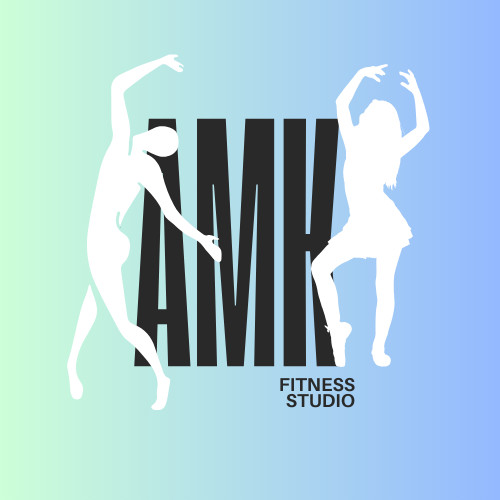

# Fitness Club database - description

*MAKi fitness stands for Mati, Alek, Karo & fitness, but it’s also a shoutout to the best bus stop in Krakow, 'Czerwone Maki P+R', where we wanna locate this amazing fitness club

## List of tables
1.	Invoices 
2.	Payments 
3.	Members
4.	Memberships
5.	IndvidualMemberships
6.	CompanyMemberships
7.	MembershipActions
8.	Leaderboard 
9.	Trainers
10. Reviews	
11.	TrainerReviews 
12.	ClassesReviews
13.	Classes 
14.	ClassTrainers 
15.	ClassEnrollments 
16.	ClassSchedules 
17.	WaitLists
18.	PersonalTrainings 
19.	Equipment 
20.	FitnessClubs
21.	Employees
22.	Merch 
23.	MerchOrders 
24.	DiscountCodes
25.	Attendence

## ERD 

*Made by Mateusz Jędrkowiak, Karolina Kulas & Aleksander Wiśniewski*

*Jagiellonian University, 2025*
